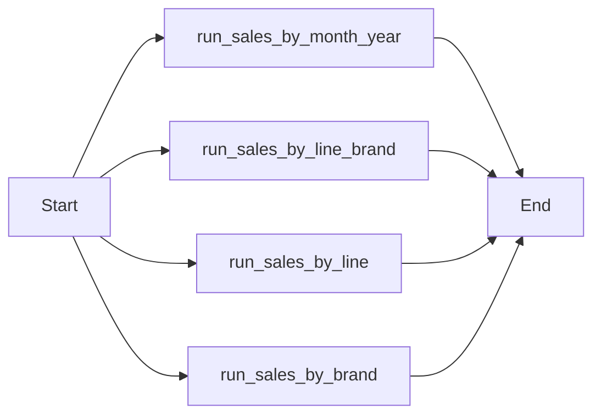

# Pipeline de Transformação de Vendas (Data Engineering)

Este projeto contém a orquestração e as transformações SQL para consolidar dados de vendas no Google BigQuery, gerando tabelas da camada "Gold" para análise.

## 📋 Visão Geral

O pipeline é orquestrado via **Apache Airflow** e executa scripts SQL utilizando o utilitário de linha de comando `bq` do Google Cloud. O processo lê dados da tabela bruta (`table_sales`) e gera agregações por diferentes dimensões (marca, linha, tempo).

## 🚀 DAG: gold_sales_transform

- **Arquivo:** `dag_sales_transform.py`
- **ID da DAG:** `gold_sales_transform`
- **Schedule:** Diariamente às 09:00 (`0 9 * * *`).
- **Owner:** airflow
- **Dependências:** Não depende de execuções passadas (`depends_on_past=False`).

### Fluxo de Execução
A DAG executa 4 tarefas em paralelo, cada uma responsável por criar uma tabela de agregação específica:



## 📊 Transformações SQL

Os scripts SQL aplicam agregações (`SUM`, `GROUP BY`) e extrações de data (`EXTRACT YEAR/MONTH`) para criar as seguintes tabelas de destino no BigQuery:

| Arquivo SQL | Tabela de Destino | Descrição | Colunas Chave |
|---|---|---|---|
| `sales_by_brand.sql` | `gold_sales_by_brand` | Vendas agregadas por **Marca** ao longo do tempo. | `marca`, `ano`, `mes`, `qtd_venda` |
| `sales_by_line.sql` | `gold_sales_by_line` | Vendas agregadas por **Linha** de produto ao longo do tempo. | `linha`, `ano`, `mes`, `qtd_venda` |
| `sales_by_line_brand.sql` | `gold_sales_by_line_brand` | Vendas totais por **Marca e Linha**. | `marca`, `linha`, `qtd_venda` |
| `sales_by_month_year.sql` | `gold_sales_by_month_year` | Vendas totais por **Ano e Mês** (visão temporal geral). | `ano`, `mes`, `qtd_venda` |

## ⚙️ Configuração

### Estrutura de Pastas Esperada pela DAG
A DAG está configurada para buscar arquivos nos seguintes caminhos relativos:

```
.
├── dag_sales_transform.py
├── ../credenciais.json           # Arquivo de credenciais do GCP
└── ../example_dags/sql/          # Diretório contendo os arquivos .sql
    ├── sales_by_month_year.sql
    ├── sales_by_line_brand.sql
    ├── sales_by_line.sql
    └── sales_by_brand.sql
```

> **Nota:** Verifique se as variáveis `GOOGLE_CREDENTIALS_PATH` e `BASE_SQL_DIR` no arquivo `.py` correspondem à estrutura real do seu ambiente de implantação.

### Requisitos
- **Apache Airflow**: Para orquestração.
- **Google Cloud SDK**: Necessário ter o comando `bq` disponível no path.
- **Service Account**: Arquivo JSON com permissões de leitura/escrita no BigQuery.
